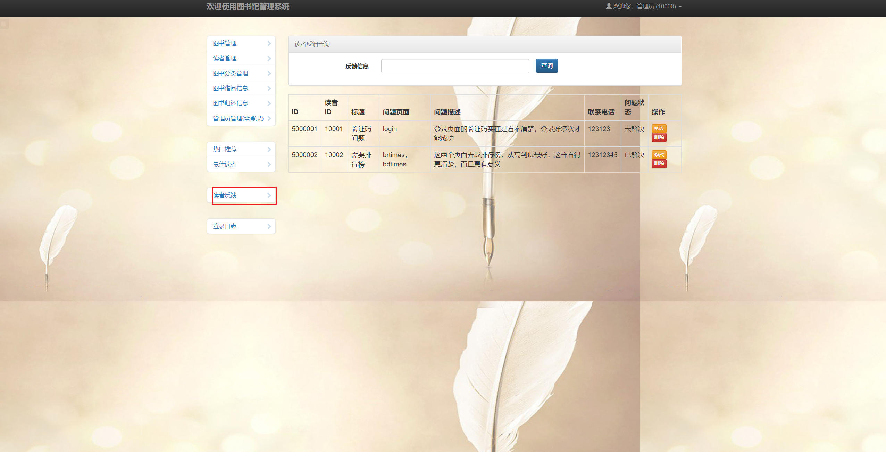

## 基于JSP+Servlet实现的图书管理系统(程序+报告)

- <b>完整代码获取地址：从戎源码网 ([https://armycodes.com/](https://armycodes.com/))</b>
- <b>技术探讨、资料分享，请加QQ群：692619798</b> 
- <b>作者微信：19941326836  QQ：952045282</b> 
- <b>承接计算机毕业设计、Java毕业设计、Python毕业设计、深度学习、机器学习</b>
- <b>选题+开题报告+任务书+程序定制+安装调试+论文+答辩ppt 一条龙服务</b>
- <b>所有选题地址 ([https://github.com/YuLin-Coder/AllProjectCatalog](https://github.com/YuLin-Coder/AllProjectCatalog)) </b>

## 项目介绍
基于JSP+Servlet实现的图书管理系统，主要功能如下

管理员的菜单：
1. 图书管理：可以对图书进行添加、删除、编辑等管理操作。
2. 读者管理：可以对读者进行添加、删除、编辑等管理操作。
3. 图书分类管理：可以对图书进行分类管理，包括添加、删除、编辑分类等。
4. 图书借阅信息：可以查看当前借阅的图书信息，包括借阅者、借阅日期等。
5. 图书归还信息：可以查看归还的图书信息，包括归还日期、逾期情况等。
6. 管理员管理(需登录)：可以对管理员进行管理，包括添加、删除、编辑管理员信息等。
7. 热门推荐：可以查看热门图书推荐信息。
8. 最佳读者：可以查看借阅次数最多或成绩最好的读者信息。
9. 读者反馈：可以查看读者的反馈信息，包括建议、问题等。
10. 登录日志：可以查看管理员的登录记录，包括登录时间、登录IP等信息。

用户的菜单：
1. 图书查询：可以通过关键字或分类进行图书查询。
2. 借阅信息：可以查看当前借阅的图书信息，包括借阅日期、借阅期限等。
3. 借阅历史：可以查看历史借阅的图书信息。
4. 热门推荐：可以查看热门图书推荐信息。
5. 最佳读者：可以查看借阅次数最多或成绩最好的读者信息。
6. 问题反馈：可以向管理员提交问题或建议。

## 项目技术
- 编程语言：Java
- 数据库：MySQL
- 前端技术：JSP、JavaScript、bootstrap、JQuery
- 后端技术：Servlet、JDBC

## 运行环境
- JDK版本：JDK1.8及以上
- 开发工具：IDEA、Ecplise、Myecplise都可以
- 数据库: MySQL5.7及以上

## 运行截图

